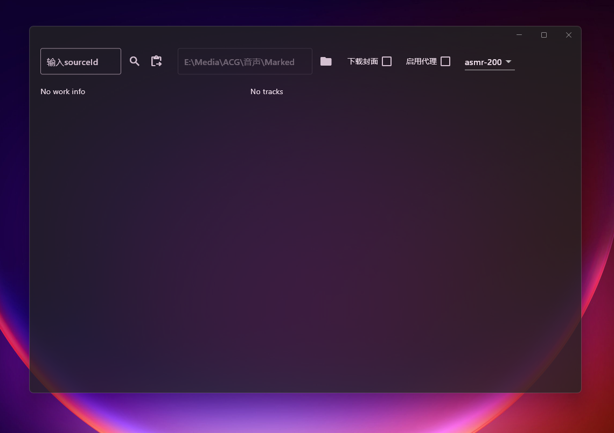
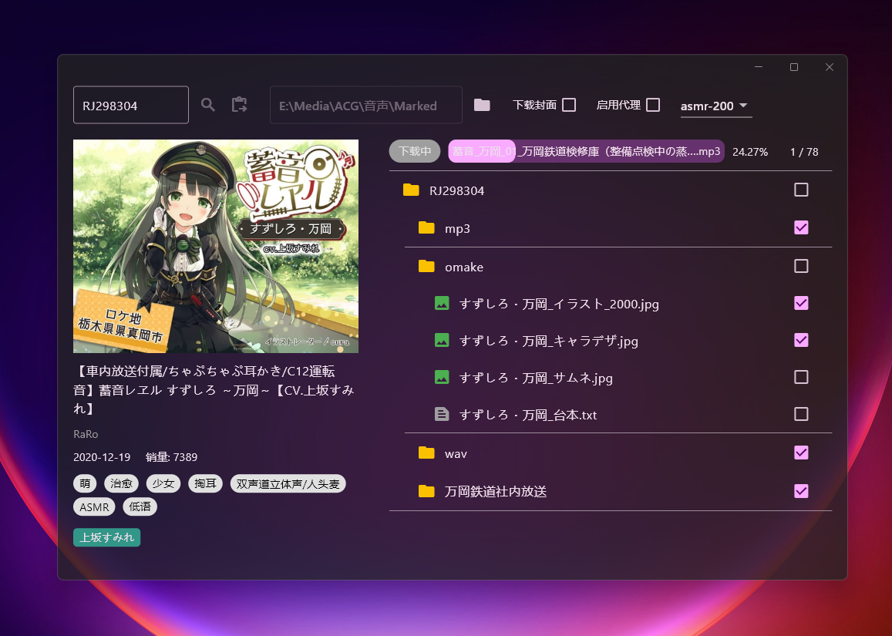
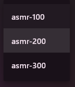
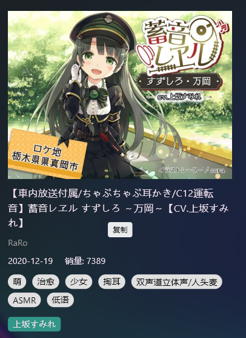

# AsmrDownloader

[https://asmr.one](https://asmr.one/)的GUI下载工具。建议搭配[zDll233/Again: flutter 本地(Windows)音声播放器](https://github.com/zDll233/Again)食用。

​​

## 使用方法

1. **搜索sourceId**：  
    左上搜索框输入`sourceId`​点击搜索，或者点击右方按钮读取剪贴板并搜索。只有`sourceId`​合法才能搜索。 

    合法的`sourceId`​：RJ, VJ或BJ开头再加上数字，忽略大小写。音声作品`sourceId`​绝大部分都是RJ号，少部分是VJ号，BJ没看到过不知道有没有，可能还有其他格式，后续再添加。
2. **选择下载任务进行下载：**   
    ​​
3. 下载配置选项  
    ​​

    1. 选择下载路径：点击文件夹按钮选择下载文件夹（默认下载位置在应用目录内）
    2. 下载封面：即搜索出来的左边图片。  
        不推荐勾选。因为分辨率不高，不如直接下载根目录下的附送图片。
    3. 启用代理：  
        检测并使用系统代理配置，**如果没有开启代理则无法勾选**。  
        一般也不需要勾选。原因见下一个配置项。
    4. api channel:  
        ​  
        这个选项只会影响搜索的api，但是不同api提供的下载api是一样的，即不会影响下载本身。  
        只有asmr-100需要启用代理，asmr-200、asmr-300和文件下载都不需要。所以大部分时候不需要开启代理，除非asmr-200、asmr-300搜索不到，可以试试asmr-100。  
        
## 功能特色

1. 断点续传：  
    应用下载之前会先检查本地是否有已下载的内容，检查文件是否下载完成。下载完成则跳过，没完成则继续下载。  
    所以你可以随意关闭应用取消下载，再重新下载，进度会被继承。  
    同理，如果网络不佳导致下载中断，应用会无限重试直到下载完成。
2. 快捷复制音声信息  
    点击即可复制。  
    ​​

‍

# 已知问题

1. 无法稳定触发的封面大小获取错误的问题。

# 其他

1. 这个只是单线程下载，所以下载速度不是很快，主要想自己写个能稳定下载的工具。  
    不过你可以打开多个应用手动多进程下载🙃
2. asmr api实现参考：[slqy123/ASMRManager: download, manage and play the voices on asmr.one](https://github.com/slqy123/ASMRManager)
3. 感谢 [https://asmr.one](https://asmr.one/)，网站运营不易，请合理使用本工具。
